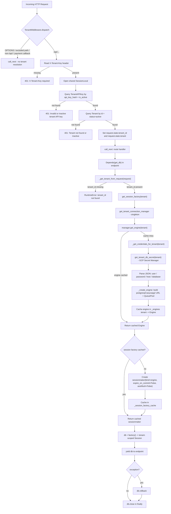

# Bookify Client-Side

## Request → Tenant DB Session Flow

How a request flows from the network edge to a tenant-scoped SQLAlchemy session.



### Step-by-step

1. **Edge — `TenantMiddleware`** ([app/core/middleware.py](app/core/middleware.py))
   - Bypasses `OPTIONS`, `EXCLUDED_PATHS`, anything not under `/api/`, and `/api/v1/payment/callback/*`.
   - Reads `X-Tenant-Key`; returns `401` if missing.
   - Looks up `TenantAPIKey` (must be active) and the owning `Tenant` (must be `active`) in the shared control-plane DB.
   - Attaches `tenant_id` and `tenant` to `request.state` so downstream code can read them.

2. **Endpoint dependency — `get_db`** ([app/core/db/session.py](app/core/db/session.py#L49))
   - Pulls `tenant_id` off `request.state` via `_get_tenant_from_request`.
   - Calls `get_session_factory(tenant)` to get (or create) a cached `sessionmaker` for that tenant.
   - Yields a `Session`; rolls back on exception and always closes in `finally`.

3. **Per-tenant engine — `TenantDBConnectionManager`** ([app/core/db/tenant_connection_manager.py](app/core/db/tenant_connection_manager.py))
   - Thread-safe singleton (`SingletonMeta`) holding a `tenant -> Engine` cache.
   - On cache miss: fetches the tenant secret from GCP Secret Manager (`get_tenant_db_secret`), parses the JSON payload, builds a `postgresql+psycopg2` URL, and creates an `Engine` with `QueuePool` (`pool_pre_ping=True`, configurable pool size / overflow / timeout / recycle).
   - Subsequent requests for the same tenant reuse the same pooled engine.

### Caches involved

| Cache | Location | Key | Value |
|---|---|---|---|
| Engine cache | `TenantDBConnectionManager._engines` | `tenant` | `sqlalchemy.Engine` (with `QueuePool`) |
| Session factory cache | `session._session_factory_cache` | `tenant` | `sessionmaker` bound to that engine |

Both are guarded by their own `Lock`; the singleton itself is guarded by `SingletonMeta._instances_lock`.

### ⚠️ Known issue in the current flow

[app/core/middleware.py:5](app/core/middleware.py#L5) does:

```python
from app.core.db.session import SessionLocal
```

…but the current [app/core/db/session.py](app/core/db/session.py) no longer defines `SessionLocal` — it only exposes the tenant-aware `get_session_factory` / `get_db`. As written, importing the middleware will raise `ImportError`, so the tenant-key validation step never runs.

To make the flow above actually work, the middleware needs a control-plane session (where `TenantAPIKey` and `Tenant` live) — either reintroduce a `SessionLocal` for the control-plane DB in `session.py`, or change the middleware to obtain its session a different way.
